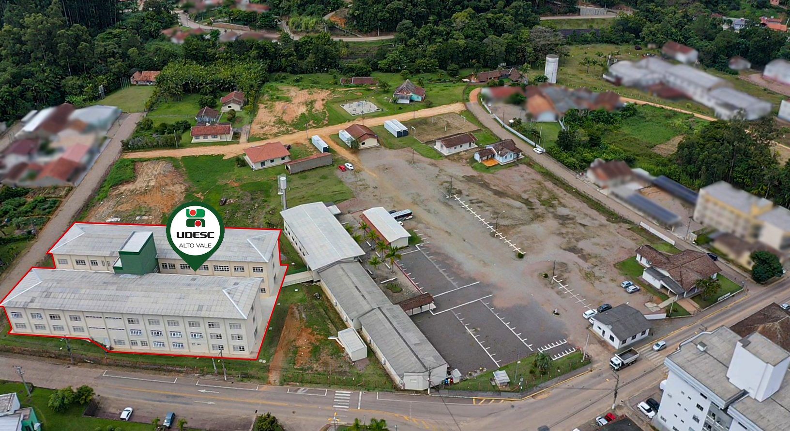

<!-- Visualizador online: https://stackedit.io/ -->
 

---

# EvacImbuia: um modelo baseado em agentes para simulação de evacuação do Bloco Imbuia.

O objetivo deste projeto é a realização simulações de evacuação do Bloco Imbuia, um edifício localizado na Universidade do Estado de Santa Catarina - UDESC, em Ibirama, Santa Catarina, Brasil. Também teve como objetivo atender o requisito de trabalho de conclusão de curso de graduação de Engenharia de Software cursado no [Centro de Educação Superior do Alto Vale do Itajaí (CEAVI/UDESC)](https://www.udesc.br/ceavi). Os participantes do projeto são:

 - [**Fábio Frare**](mailto:fabiofrare.jb@@gmail.com) (autor do projeto e acadêmico de Engenharia de Software).
 - [**Fernando dos Santos**](mailto:fernando.santos@udesc.br) (orientador do projeto e professor no curso de Engenharia de Software).

As simulações foram realizadas com o auxílio do software [PTV Vissim /Viswalk](https://www.ptvgroup.com/pt-br), no qual permite simulações baseadas em agentes.

O Bloco Imbuia é um edifício composto de três pavimentos integrando 16 salas de aula, 35 salas administrativas e 12 laboratórios, que garantem um aumento significativo na capacidade de atendimento do centro de ensino. 

>Figura 1: Vista aérea do Bloco Imbuia

